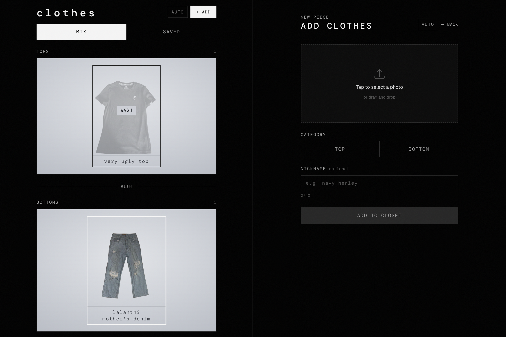

<!-- prettier-ignore -->
<div align="center">


# clothes

*Upload pieces from your wardrobe, pair tops and bottoms, and save outfits that work.*

[](https://nextjs.org)
[](https://convex.dev)
[](https://www.typescriptlang.org)
[](https://bun.sh)
[](https://developers.cloudflare.com/workers/)

[Features](#features) • [Getting started](#getting-started) • [Deploy](#deploy)



</div>

A small personal closet app. Photos go into a two-reel mixer: tops on one strip, bottoms on the other. Scroll or tap to pair them, mark pieces as in the wash, and keep the combinations you like.

The UI is a [Next.js](https://nextjs.org) App Router app. Data and images live in [Convex](https://convex.dev). The production build ships to [Cloudflare Workers](https://developers.cloudflare.com/workers/) through [OpenNext](https://opennext.js.org/cloudflare).

## Features

- **Mixer** with independently scrolling top and bottom strips
- **Uploads** tagged as top or bottom, with an optional nickname
- **Background cutouts** run in the browser after upload, so pieces sit on a clean field
- **Laundry toggle** to mark an item unavailable without deleting it
- **Saved matches** for pairings you want to keep
- **Passcode gate** when `PASSCODE` is set on the Convex deployment
- **Theme** that follows system, light, or dark
- **Realtime updates** from Convex as the closet changes

## Prerequisites

- [Bun](https://bun.sh)
- A [Convex](https://dashboard.convex.dev) account
- [Git](https://git-scm.com)

A [Cloudflare](https://dash.cloudflare.com) account is only needed if you want to deploy.

## Getting started

1. Clone the repo and install dependencies:

   ```bash
   git clone https://github.com/ireallywantthatname/clothes.git
   cd clothes
   bun install
   ```

2. Start the Convex backend. The first run walks you through logging in and creating a deployment, then writes `NEXT_PUBLIC_CONVEX_URL` to `.env.local`:

   ```bash
   bunx convex dev
   ```

3. In a second terminal, start the Next.js app:

   ```bash
   bun run dev
   ```

4. Open [http://localhost:3000](http://localhost:3000).

> [!NOTE]
> The closet is open if `PASSCODE` is unset. To lock it, set the variable on the Convex deployment:
>
> ```bash
> bunx convex env set PASSCODE your-secret
> ```
>
> A successful unlock is stored in the browser for 30 days.

## Scripts

| Command | What it does |
| --- | --- |
| `bun run dev` | Next.js dev server |
| `bunx convex dev` | Sync Convex functions and keep the backend running |
| `bun run lint` | Biome check |
| `bun run format` | Biome format |
| `bun run build` | Production Next.js build |
| `bun run deploy` | Build with OpenNext and deploy to Cloudflare Workers |

## How it works

```
browser  -->  Next.js (Cloudflare Worker)
                 |
                 +-->  Convex queries / mutations
                 |         clothes, matches, passcode
                 |
                 +-->  Convex file storage
                           original + cutout images
```

- Clothing rows live in `clothes` (`top` or `bottom`, `available` or `unavailable`, optional nickname).
- Photos are stored as Convex `_storage` IDs and served with `ctx.storage.getUrl`.
- After upload, the browser runs [`@imgly/background-removal`](https://github.com/imgly/background-removal-js) against self-hosted model files in `public/bg-removal/`, then replaces the stored image with the cutout.
- Saved outfits live in `matches` as a `topId` + `bottomId` pair. Duplicate pairs are rejected.

## Deploy

The Worker is configured in `wrangler.jsonc`. From a machine that is already logged into Cloudflare and Convex:

```bash
bunx convex deploy
bun run deploy
```

`bun run deploy` runs `opennextjs-cloudflare build` and `opennextjs-cloudflare deploy`. Point `NEXT_PUBLIC_CONVEX_URL` at the production Convex deployment before building.

> [!TIP]
> Use `bun run preview` to build and try the Worker locally before shipping it.
